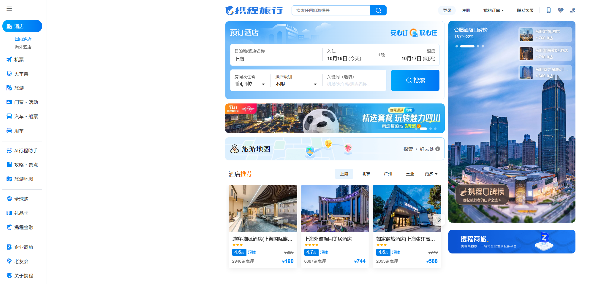
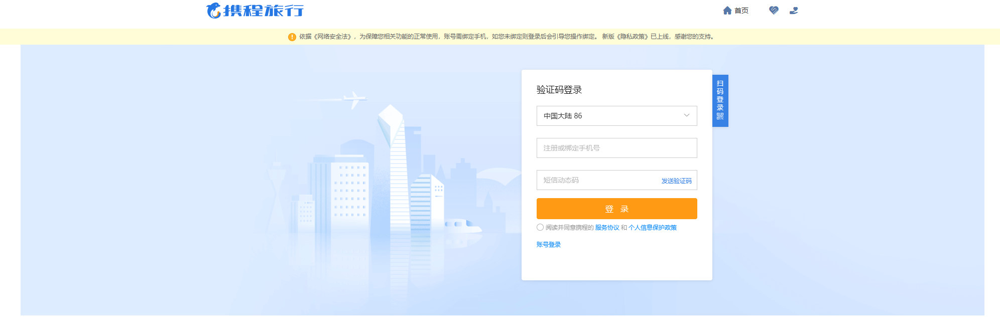
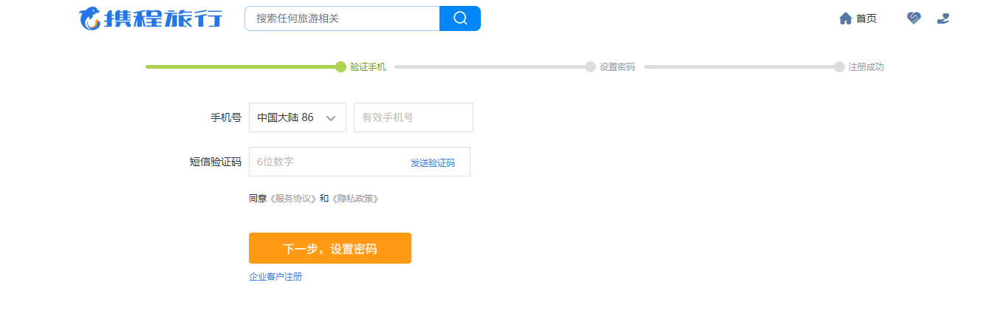
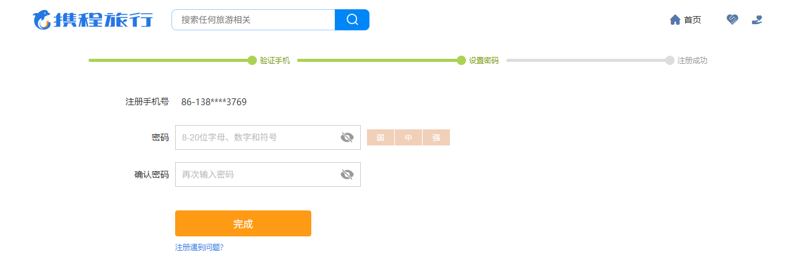

# 携程网站复制版功能需求文档

## 项目概述

本项目旨在复制携程网站(ctrip.com)的核心功能，主要包括首页展示、机票预订、用户登录注册、订单管理等功能模块。项目将实现简洁、易用的用户界面，提供流畅的用户体验。

## 功能模块

### 1. 首页模块

#### 1.1 首页展示
**界面截图参考**: 

##### 1.1.1 进入方式：
- 用户直接访问网站根路径
- 用户点击网站Logo返回首页

##### 1.1.2 页面元素：
- 网站Logo和品牌标识
- 主导航栏（机票、登录、注册、我的订单）
- 机票搜索表单区域
  - 出发城市选择框
  - 到达城市选择框
  - 出发日期选择器
  - 返程日期选择器（可选）
  - 乘客类型选择（成人、儿童、婴儿）
  - 舱位类型选择（经济舱、商务舱、头等舱）
  - 搜索按钮
- 热门目的地推荐区域
- 特价机票展示区域
- 页脚信息区域

**Scenario: 用户访问首页**
```gherkin
Given 用户打开浏览器
When 用户输入网站地址并访问
Then 页面应显示完整的首页内容
And 所有导航链接应可正常点击
And 机票搜索表单应正确显示
```


### 2. 用户认证模块

#### 2.1 用户登录
**界面截图参考**: 
- 
- 

##### 2.1.1 进入方式：
- 点击首页"登录"按钮
- 访问需要登录的页面时自动跳转

##### 2.1.2 页面元素：
- 登录方式切换标签（账号密码登录、验证码登录）
- 初始为账号密码登录，点击验证码登录切换为验证码登录表单
- 账号密码登录表单：
  - 手机号/邮箱输入框
  - 密码输入框
  - 记住登录状态复选框
  - 登录按钮
  - 忘记密码链接
- 验证码登录表单：
  - 手机号输入框
  - 验证码输入框
  - 获取验证码按钮
  - 登录按钮
- 第三方登录选项（仅UI展示）
  - 微信登录按钮
  - QQ登录按钮
  - 微博登录按钮
- 注册链接

**Scenario: 用户使用账号密码登录**
```gherkin
Given 用户在登录页面
And 用户选择"账号密码登录"标签
When 用户输入正确的手机号
And 用户输入正确的密码
And 用户点击登录按钮
Then 系统应验证用户凭据
And 登录成功后跳转到首页
And 显示用户已登录状态
```

**Scenario: 用户使用验证码登录**
```gherkin
Given 用户在登录页面
And 用户选择"验证码登录"标签
When 用户输入手机号"13800138000"
And 用户点击"获取验证码"按钮
Then 系统应发送验证码到用户手机
And 获取验证码按钮应显示倒计时
When 用户输入正确的验证码
And 用户点击登录按钮
Then 用户应成功登录并跳转到首页
```

**Scenario: 用户登录失败处理**
```gherkin
Given 用户在登录页面
When 用户输入错误的手机号或密码
And 用户点击登录按钮
Then 系统应显示错误提示信息
And 用户应保持在登录页面
And 输入框应保持用户已输入的内容（密码除外）
```

#### 2.2 用户注册
**界面截图参考**: 
- 
- 

##### 2.2.1 进入方式：
- 点击首页"注册"按钮
- 从登录页面点击"注册"链接

##### 2.2.2 页面元素：
- 注册步骤指示器
- 手机号验证步骤：
  - 手机号输入框
  - 验证码输入框
  - 获取验证码按钮
  - 下一步按钮
  - 用户协议复选框
  - 用户协议链接
- 密码设置步骤：
  - 密码输入框
  - 确认密码输入框
  - 密码强度指示器
  - 完成注册按钮
- 已有账号登录链接

**Scenario: 用户完成手机号注册**
```gherkin
Given 用户在注册页面
When 用户输入有效手机号"13800138000"
And 用户点击"获取验证码"按钮
And 用户输入正确的验证码
And 用户勾选用户协议复选框
And 用户点击"下一步"按钮
Then 系统应验证手机号和验证码
And 跳转到密码设置页面
```

**Scenario: 用户设置登录密码**
```gherkin
Given 用户在密码设置页面
When 用户输入密码"Password123!"
And 用户确认密码"Password123!"
And 用户点击"完成注册"按钮
Then 系统应创建新用户账号
And 自动登录用户
And 跳转到首页
And 显示注册成功提示
```

**Scenario: 用户注册信息验证失败**
```gherkin
Given 用户在注册页面
When 用户输入已注册的手机号
And 用户点击"获取验证码"按钮
Then 系统应显示"该手机号已注册"错误提示
And 提供跳转到登录页面的选项
```
